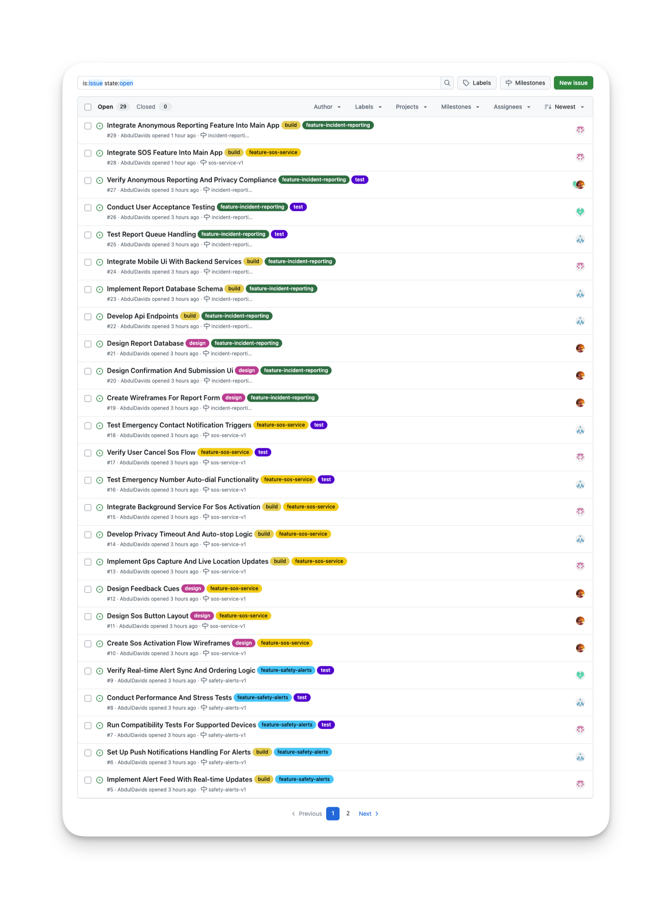
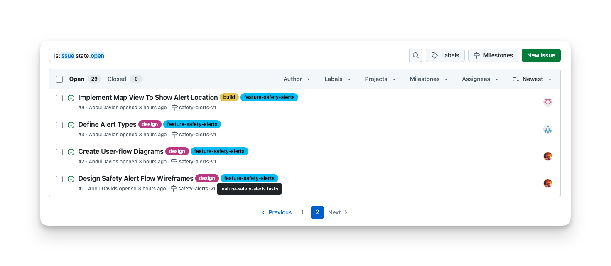
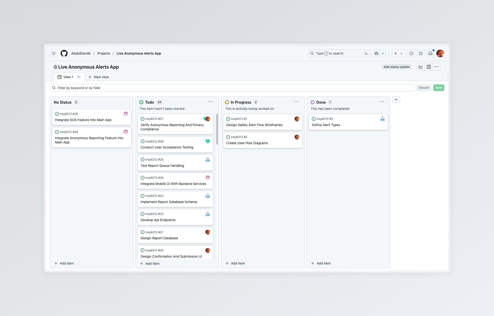

# How We Organized Our Team and Tasks

Setting up a new project can be overwhelming, so we took some time to plan things properly. We imported all our planned tasks into GitHub issues and made sure everyone knows what they're responsible for.

## Our Team Members

For this project, we've mapped our actual team members to the roles in the requirements. Our team serves as drop-in replacements for the original roles while maintaining the same responsibilities:

| Role in Requirements | Our Team Member | GitHub Username | Main Responsibilities |
|---------------------|-----------------|----------------|----------------------|
| Sundar (UI/UX Designer) | Abdul | @AbdulDavids | Creating wireframes, designing user interfaces, and UX |
| Mark (Mobile Application Engineer) | Joshua | @JoshuaWood13 | Developing mobile app, implementing frontend |
| Tim (Product Manager) | Abdul (alt) | @anotherdavids | Overseeing product quality, planning features, and testing |
| Jeff (Backend Software Engineer) | Nicholas | @nicholasphillipsST10263496 | Building APIs, database design, and backend  |

Each team member has a clear area of focus based on their role. The design and UI/UX tasks go to Abdul (as Sundar) first, then Joshua (as Mark) implements these designs in the mobile app, while Abdul's alt account (as Tim) manages the product direction and quality and Nicholas (as Jeff) develops the backend systems that power everything.

We've also added a project board to keep track of the issues and their progress.

